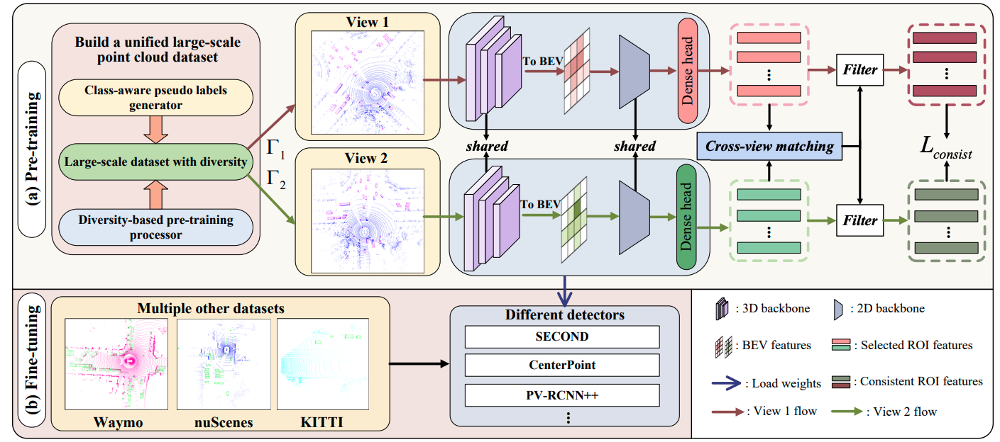

# AD-PT: Autonomous Driving Pre-Training with Large-scale Point Cloud Dataset
This repo is for our arxiv paper.

**Paper**: [[arxiv]](https://arxiv.org/pdf/2306.00612.pdf) &nbsp;

**Code**: Code is avaiable in [[3DTrans]](https://github.com/PJLab-ADG/3DTrans). 

**Authors**: Jiakang Yuan, Bo Zhang, Xiangchao Yan, Tao Chen, Botian Shi, Yikang Li, Yu Qiao.


## Abstract
It is a long-term vision for Autonomous Driving (AD) community that the perception models can learn from a large-scale point cloud dataset, to obtain unified representations that can achieve promising results on different tasks or benchmarks. Previous works mainly focus on the self-supervised pre-training pipeline, meaning that they perform the pre-training and fine-tuning on the same benchmark, which is difficult to attain the performance scalability and cross-dataset application for the pre-training checkpoint. In this paper, for the first time, we are committed to building a large-scale pre-training point-cloud dataset with diverse data distribution, and meanwhile learning generalizable representations from such a diverse pre-training dataset. We formulate the point-cloud pre-training task as a semi-supervised problem, which leverages the few-shot labeled and massive unlabeled point-cloud data to generate the unified backbone representations that can be directly applied to many baseline models and benchmarks, decoupling the AD-related pre-training process and downstream fine-tuning task. During the period of backbone pre-training, by enhancing the scene- and instance-level distribution diversity and exploiting the backbone’s ability to learn from unknown instances, we achieve significant performance gains on a series of downstream perception benchmarks including Waymo, nuScenes, and KITTI, under different baseline models like PV-RCNN++, SECOND, CenterPoint.



## Code 
Bi3D codes have been released to [[3DTrans]](https://github.com/PJLab-ADG/3DTrans).


## Citation
If you find this work useful in your research, please consider cite:
```
@article{yuan2023ad,
  title={AD-PT: Autonomous Driving Pre-Training with Large-scale Point Cloud Dataset},
  author={Yuan, Jiakang and Zhang, Bo and Yan, Xiangchao and Chen, Tao and Shi, Botian and Li, Yikang and Qiao, Yu},
  journal={arXiv preprint arXiv:2306.00612},
  year={2023}
}
```
If you encounter any issues or have questions, please feel free to contact us via jkyuan22@m.fudan.edu.cn.
